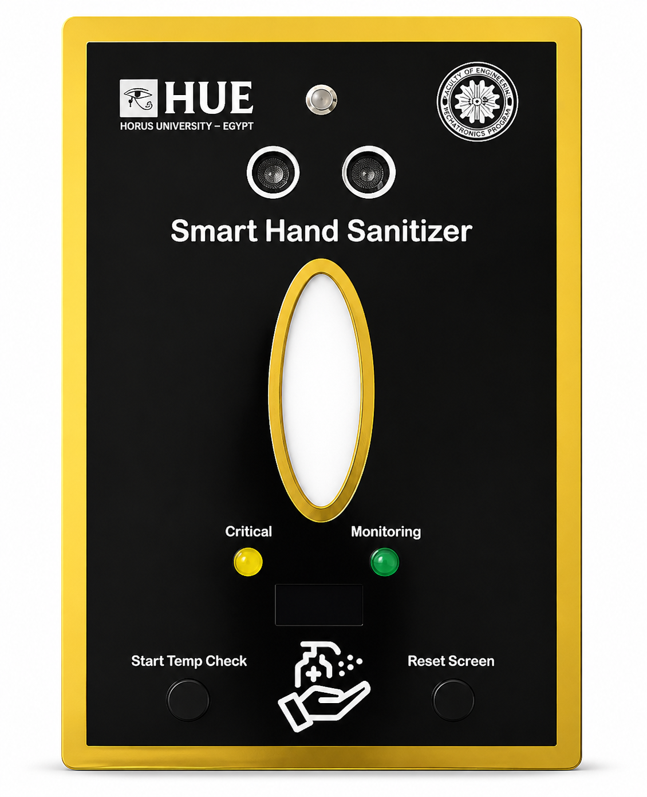
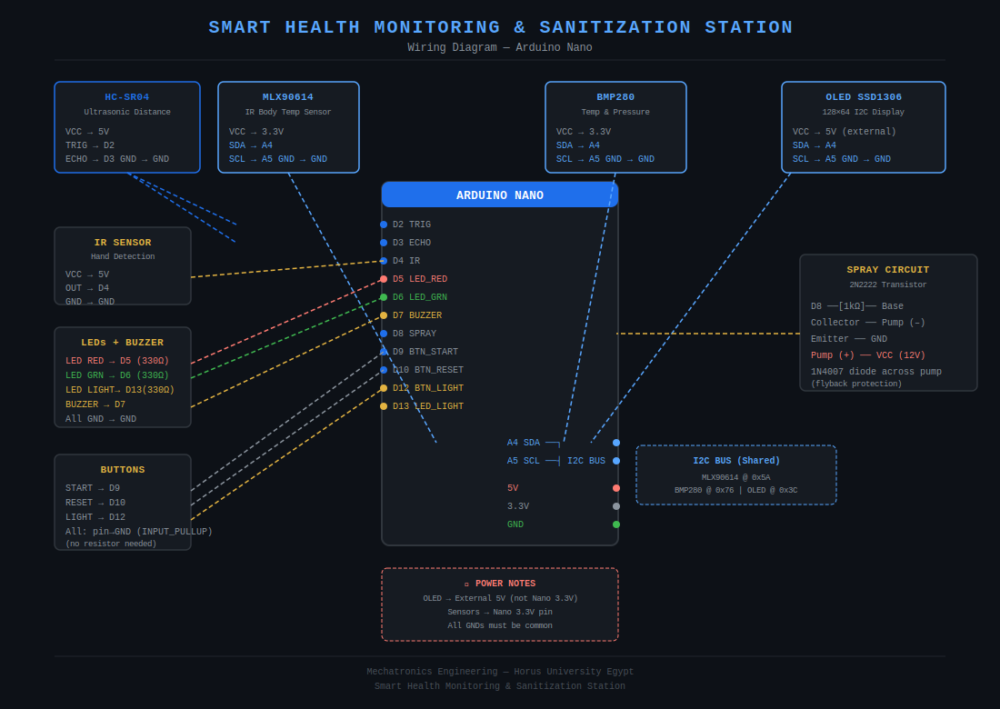

# 🏥 Smart Health Monitoring & Sanitization Station

An automated health screening station built on Arduino Nano that measures body temperature contactlessly and dispenses hand sanitizer — all without physical contact.

---

## 📸 Demo



---

## ⚙️ Components

| Component | Description | Pin |
|---|---|---|
| Arduino Nano | Main microcontroller | — |
| MLX90614 | Contactless IR body temp sensor | A4 (SDA), A5 (SCL) |
| BMP280 | Ambient temperature & pressure | A4 (SDA), A5 (SCL) |
| SSD1306 OLED 128×64 | Real-time display | A4 (SDA), A5 (SCL) |
| HC-SR04 | Ultrasonic distance sensor | D2 (TRIG), D3 (ECHO) |
| IR Sensor | Hand detection | D4 |
| LED Red | Abnormal temp indicator | D5 |
| LED Green | Monitoring / spraying indicator | D6 |
| Buzzer | Audio feedback | D7 |
| 2N2222 + Pump | Spray circuit | D8 |
| BTN Start | Start temp scan | D9 |
| BTN Reset | System reset | D10 |
| BTN Light | Manual lighting toggle | D12 |
| LED Light | Manual light | D13 |

---

## 🔌 Wiring Diagram



---

## 🚦 State Machine

```
IDLE ──[START]──> SCAN ──[< 5cm]──> MEASURE ──[4 readings]──> RESULT ──[hand detected]──> SPRAYING ──> IDLE
```

| State | Description |
|---|---|
| IDLE | Displays ambient temp & pressure |
| SCAN | Reads ultrasonic distance |
| MEASURE | Takes 4 MLX readings, shows progress bar |
| RESULT | Displays body temp, LEDs indicate status |
| SPRAYING | Spray active while hand present (max 5s) |

---

## 💡 Features

- ✅ Contactless body temperature measurement (+3.5°C offset calibration)
- ✅ Fever detection with 2-second audio alert (threshold: 38.5°C)
- ✅ Spray only activates when hand is detected — pauses if hand removed
- ✅ Real-time ambient data (temperature + pressure) on OLED
- ✅ LED indicators: Green during scan, Red for abnormal temp
- ✅ Manual lighting toggle (D12 button)
- ✅ System reset (preserves light state)
- ✅ Beep feedback on every button press

---

## 📚 Libraries Required

Install via Arduino Library Manager:

- `Adafruit SSD1306`
- `Adafruit GFX Library`
- `Adafruit BMP280 Library`
- `Adafruit MLX90614 Library`

---

## ⚡ Power Notes

- **OLED** → External 5V (not Nano's 3.3V — insufficient current)
- **Sensors** (MLX, BMP280) → Nano 3.3V pin
- **All GNDs must be common**
- Add a **1N4007 diode** across the pump terminals for flyback protection

---

## 🔧 Calibration

The MLX90614 measures skin surface temperature, which is ~3-4°C lower than core body temperature. A **+3.5°C offset** is applied in the code. Adjust this value based on your sensor's readings compared to a reference thermometer:

```cpp
bodyT = (mlxS / mlxN) + 3.5;  // adjust offset here
```

Normal temperature range is set to **36.5°C – 38.5°C**.

---


## 🎓 About

Built as part of Mechatronics Engineering studies at **Horus University Egypt (HUE)**.


